2.45# mapbox-gl-draw-bezier-curve-mode

A [mapbox gl draw](https://www.npmjs.com/package/@mapbox/mapbox-gl-draw) mode to draw and edit bezier curves.


# Demo
### Demo page : https://mapbox-gl-draw-bezier-curve-demo.numix.fr

## Preview
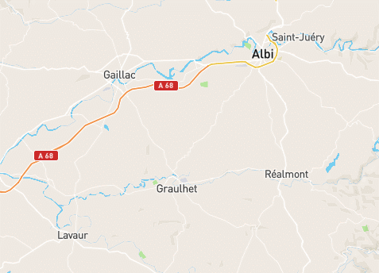

# Usage

## Bezier Curve Draw mode
Use the Bezier tool to enter in Bezier Curve Draw mode : 

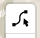

### **Alt + Drag with Left click** to create nodes with bezier handles.
Hit **Enter** or **Left click on the last node** to finish the curve

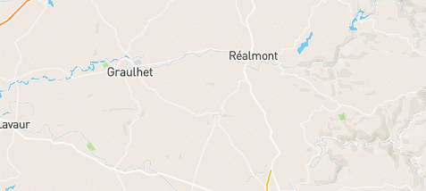

### **Left mouse click** to create nodes **without** handles (same as line string tool)
Bezier Curves can have nodes with or without handles


### Close a curve by connecting the last node to the first one :


### Remove last added nodes with **Right click**

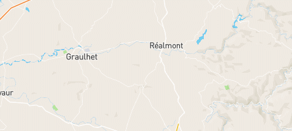

---

## Bezier Curve Editing 
To edit a bezier curve, enter in direct mode
### Select a node, then **drag with left click** to move bezier handles :


### Break bezier handle symmetry 
Select a node, then **Alt + Drag with left click** on a bezier handle :

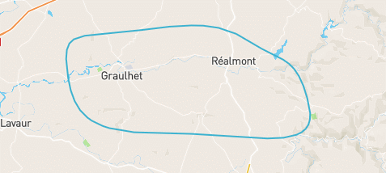

### Toggle node handles
When bezier handles are visible, **Alt + Left Click** on the node will remove the handles :

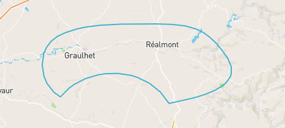

When bezier handles are not visible **Alt + Drag with left click** on the node will show the handles :

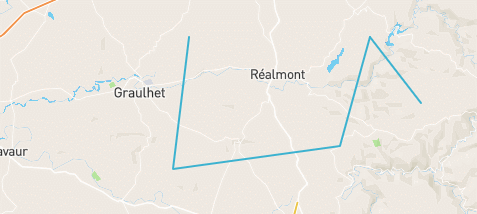

### Create new nodes in between
In direct mode, click on a midpoint to create a new node inside the curve :

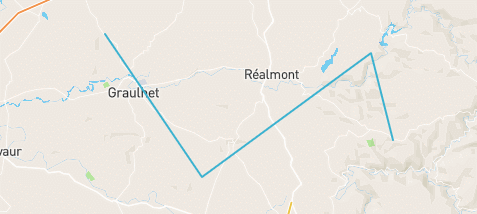

### Delete node
Select a node and hit **Delete key**

---

## Combine/Uncombine extended support
Combining / uncombining bezier curves is supported. In Direct mode there are some additional features :

### Direct mode Combine two vertices from a different bezier curve
If two bezier curves where previously combined, its possible to combine them into a single curve by selecting two vertices.

To do so :
- Select two curves
- Hit Combine to group them
- Enter in Direct mode and select two vertices
- Hit Combine again to link the two curves together

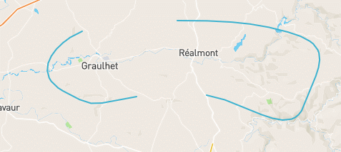

### Close a curve
Close the curve by combining the first and last node in direct mode.

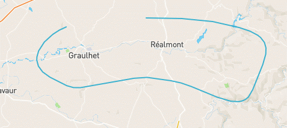

## Open a curve
When a curve is closed, open it by uncombining a single vertex. It will be splitted in two separate vertices allowing the curve to be open again.

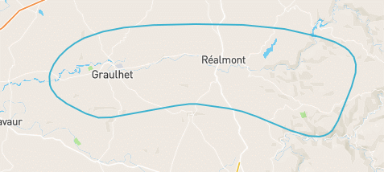


## Split curves
Select vertices on a non closed curve to split it in multiple curves. The result will be a combined curve. Uncombine it in **simple_select mode** to be able to move each curve independently.

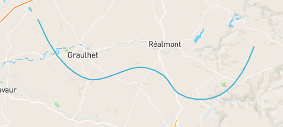

# Installation
## To Install: 
    yarn install mapbox-gl-draw-bezier-curve-mode
## To Use:
```js
import {
  SimpleSelectModeBezierOverride, 
  DirectModeBezierOverride, 
  DrawBezierCurve, 
  customStyles,
} from 'mapbox-gl-draw-bezier-curve-mode';

var draw = new MapboxDraw({
    displayControlsDefault: false,
    userProperties: true,
    modes: {
    ...MapboxDraw.modes,
    simple_select: SimpleSelectModeBezierOverride,
    direct_select: DirectModeBezierOverride,
    draw_bezier_curve: DrawBezierCurve,
    },
    styles: customStyles
});

var map = new mapboxgl.Map({
  container: 'map',
  style: 'mapbox://styles/mapbox/streets-v8',
  center: [2.45, 46.59],
  zoom: 5.8
});

map.addControl(Draw)
```

See [demo](https://github.com/Jeff-Numix/mapbox-gl-draw-bezier-curve-mode/tree/master/demo) package for a full example.

More information about mapbox-gl-draw :
* [API](https://github.com/mapbox/mapbox-gl-draw/blob/main/docs/API.md)
* [Draw Modes](https://github.com/mapbox/mapbox-gl-draw/blob/main/docs/MODES.md)
* [Examples](https://github.com/mapbox/mapbox-gl-draw/blob/main/docs/EXAMPLES.md)
# Dependencies
[mapbox-gl](https://www.npmjs.com/package/mapbox-gl)

[mapbox-gl-draw](https://www.npmjs.com/package/@mapbox/mapbox-gl-draw)

[mathjs](https://www.npmjs.com/package/mathjs)


# Changelog 
### v1.0.0
* First version

# Known issues
### v1.0.0 
* When combining/uncombining vertices in direct mode, the shape will not refresh until you move or click anywhere else.

If you find an issue, please refer : https://github.com/Jeff-Numix/mapbox-gl-draw-bezier-curve-mode/issues
# Licence
MIT © JeffSebrechts

# Credits
Developed by Jeff Sebrechts
* linkedin : [linkedin](https://www.linkedin.com/in/jeff-sebrechts/)
* website : [wwww.numix.fr](https://www.numix.fr)

